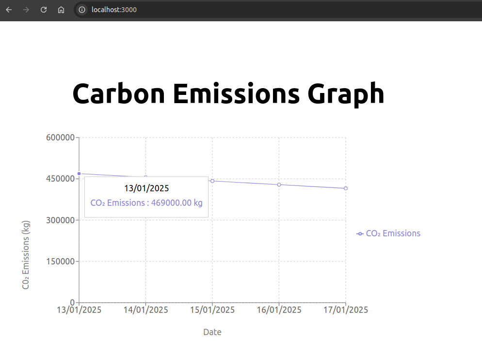

# Keep It Green Dashboard
This app aims to provide valuable analytics for businesses to achieve their sustainability goals.

## Purpose of this Application
Many sectors in Australia face challenges related to carbon emissions and energy consumption as the
nation works towards its Net Zero targets. The Keep It Green Dashboard empowers businesses to 
address these challenges by providing real-time tracking and analysis of energy usage and
carbon emissions, enabling data-driven decisions to achieve sustainability goals.

## Dashboard Preview

* NOTE: This data comes from average electricty usage (kWh) of a common mining site (or a factory)
* Assuming that a mining site uses around 700,000 kWh total electricity per day
  * Formula to calculate C02 emissions from electricity usage:
    * emissions = electricity usage * emission factor
      * = 700,000 (kWh) * 0.67
      * = approximately 469,000 kg CO2e per day
    * emission factor obtained from Western Power, specifically the State of Western Australia
      * link: https://www.westernpower.com.au/news/emissions-intensity-what-it-means-for-our-sustainable-future/

## Tech Stack

### Frontend Libraries
- React
- TypeScript
- Recharts for data visualisation
- Axios for API calls

### Backend Libraries
- Django
- Django REST Framework
- PostgreSQL
- Python v3

### Deployment Process
This project uses Docker containers to deploy backend and frontend applications on AWS.

## TO DO
1. Add import CSV functionality
1. Add import CSV button
1. Add export PDF functionality
1. Add export PDF button
