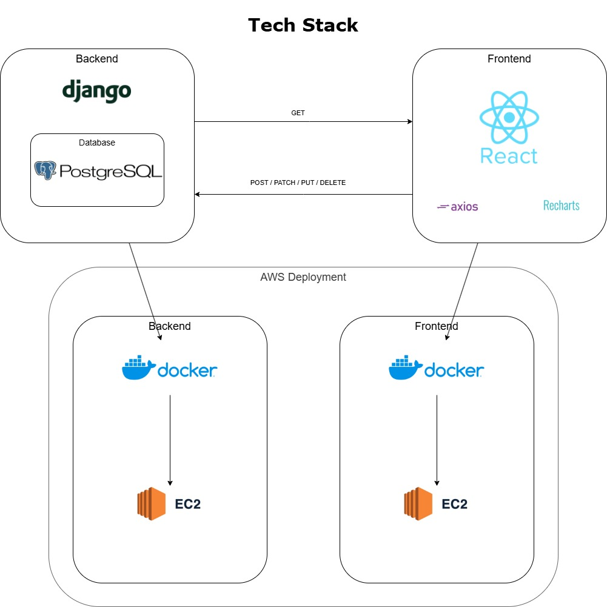

# Keep It Green Dashboard
This app aims to provide valuable analytics for businesses to achieve their sustainability goals.

# Purpose of this Application
Many sectors in Australia face challenges related to carbon emissions and energy consumption as the nation works towards its Net Zero targets. The Keep It Green Dashboard empowers businesses to address these challenges by providing real-time tracking and analysis of energy usage and carbon emissions, enabling data-driven decisions to achieve sustainability goals.

A personal purpose of making this application is to understand all mechanics of developing a 
<b>modern</b> full-stack software web application.

# Tech Stack

## Frontend Libraries
- Main Component = <b>React.js</b>
- Configuration = Vite

## Backend Libraries
- Main Component = <b>Django</b>
